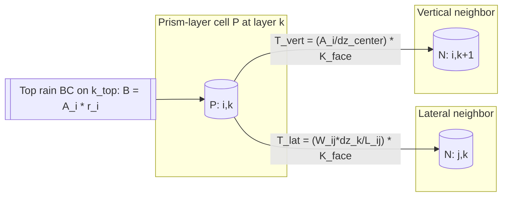

# 3D Richards Discretization (Celia et al., 1990) Mapped to `richards_model.py`

This document explains how the solver in `solver/richards_model.py` implements a Celia et al. (1990)-style modified-Picard discretization of the mixed-form Richards equation on a 3D prism-layer domain.

---

## 1) Governing Equation and Unknown

The mixed-form Richards equation is

$$
\frac{\partial \theta(h)}{\partial t}
= \nabla\cdot\left(K(h)\nabla(h+z)\right) + q,
$$

where $h$ is pressure head, $\theta(h)$ is water content, $K(h)$ is hydraulic conductivity, and $z$ is elevation head.

In this implementation, internal volumetric source $q$ is omitted and infiltration is handled through a top-boundary flux term.

---

## 2) Celia et al. (1990) Modified Picard Form

At time step $n\to n+1$, with Picard iterate $m$, define correction

$$
\delta h = h^{m+1}-h^m.
$$

Linearize storage using

$$
\theta(h^{m+1}) \approx \theta(h^m) + C(h^m)\delta h,
\qquad C(h)=\frac{d\theta}{dh}.
$$

The per-control-volume linear equation is

$$
\frac{V_P C_P^m}{\Delta t}\,\delta h_P
+ \sum_{N\in\mathcal N(P)} T_{PN}(\delta h_P-\delta h_N)
= -\frac{V_P(\theta_P^m-\theta_P^n)}{\Delta t}
+ \sum_{N\in\mathcal N(P)} T_{PN}\left[(h_N^m-h_P^m)+(z_N-z_P)\right]
+ B_P.
$$

Then update

$$
h^{m+1}=h^m+\delta h.
$$

This is exactly the algebra assembled in `solve_step`.

---

## 3) 3D Domain Representation in `RichardsSolver`

The geometry is 3D but not Cartesian-cube-only. It is a stack of vertical layers over horizontal prisms:

- Horizontal cells: prisms indexed by `i`.
- Vertical cells: layers indexed by `k` with thickness `dz[k]`.
- 3D cell $(i,k)$ volume:

$$
V_{ik} = A_i\,\Delta z_k,
$$

where $A_i = \texttt{A_ij[i]}$.

Flattened index in code:

$$
\texttt{idx} = k\,n_{\mathrm{prisms}} + i.
$$

So this is still a 3D finite-volume method, but with unstructured lateral connectivity and structured vertical layering.

---

## 4) Flux Discretization (Finite Volume)

For any adjacent cells $P$ and $N$:

$$
F_{P\leftarrow N} = T_{PN}\left[(h_N-h_P)+(z_N-z_P)\right].
$$

Conductivity at the face uses harmonic averaging:

$$
K^{\text{face}}_{PN} = \frac{2}{1/K_P + 1/K_N}.
$$

Transmissibility is

$$
T_{PN}=G_{PN}K^{\text{face}}_{PN},
$$

with geometry factor $G_{PN}$ computed differently for vertical and lateral neighbors.

### 4.1 Vertical neighbors (same prism, adjacent layer)

In `solve_step`, for `adj_k = k +/- 1`:

$$
G_v = \frac{A_i}{\Delta z_{\text{center}}},
\qquad
\Delta z_{\text{center}} = |Z_{i,adj_k} - Z_{i,k}|.
$$

`Z` is built from `base_elevations` and `dz` via `get_z_centers`.

### 4.2 Lateral neighbors (same layer, adjacent prisms)

For prism neighbors `i` and `j` from `adj_prisms`:

$$
G_{lat} = \frac{W_{ij}\,\Delta z_k}{L_{ij}},
$$

implemented by `get_G_lateral(i, j, k)` using `W_ij` and `L_ij`.

This is the face-area-over-distance finite-volume metric for irregular horizontal geometry.

---

## 5) Term-by-Term Mapping to `solve_step`

### 5.1 Storage (Celia modified-Picard part)

For each cell `(i,k)`:

```python
V_ik = self.A_ij[i] * self.dz[k]
Ci = self.get_C(h_m[idx_i], k, i)
theta_m = self.get_theta(h_m[idx_i], k, i)
theta_n = self.get_theta(h_n[idx_i], k, i)

LHS[idx_i, idx_i] += V_ik * Ci / dt
RHS[idx_i] -= (V_ik / dt) * (theta_m - theta_n)
```

This is

$$
\frac{V_{ik}C_{ik}^m}{\Delta t}\delta h_{ik}
\quad\text{and}\quad
-\frac{V_{ik}(\theta_{ik}^m-\theta_{ik}^n)}{\Delta t}.
$$

### 5.2 Diffusion/flow operator and gravity term

For each neighbor `N`:

```python
LHS[idx_i, idx_i] += conductance
LHS[idx_i, idx_N] -= conductance
RHS[idx_i] += conductance * total_head_grad
```

with

```python
conductance = G * K_face
total_head_grad = (h_N - h_i) + (z_N - z_i)
```

This is the fully expanded discrete form of the operator sometimes written abstractly as $\mathcal{L}[K^m]$.

### 5.3 Top infiltration boundary

Boundary contribution is assembled before cell loops:

```python
RHS = self.apply_top_boundary(RHS)
```

Inside `apply_top_boundary`:

$$
B_{i,k_{top}} = A_i\,r_i,
$$

where $r_i$ is rainfall intensity from `rainfall_intensity`, `rainfall_prisms`, or `rainfall_by_prism`.

---

## 6) Constitutive Relations and Celia Consistency

The solver uses van Genuchten-Mualem functions:

- `get_theta(h, lay, prism)` for retention,
- `get_K(h, lay, prism)` for conductivity,
- `get_C(h, lay, prism)` for capacity.

For saturated cells (`h >= 0`):

- `theta = theta_s`,
- `K = Ks`,
- `C = S_s`.

Using `S_s` in saturation is consistent with robust mixed-form formulations and avoids degenerate zero-capacity behavior.

---

## 7) Why `richards_model.py` Matches Celia et al. (1990)

The implementation matches the Celia-style approach because it has all key ingredients:

1. Mixed form: time derivative is on $\theta(h)$, not directly on $h$.
2. Modified Picard: storage linearized with $C(h^m)\delta h$ and correction update $h^{m+1}=h^m+\delta h$.
3. Conservative control-volume fluxes across all interfaces (vertical and lateral).
4. Face conductivity via harmonic averaging.
5. Fully implicit linear solve each Picard iteration (`spsolve`) with infinity-norm convergence test.

So although the horizontal geometry is prism-based/unstructured rather than Cartesian $(x,y)$ indexing, the algorithmic structure is the same Celia 1990 modified-Picard finite-volume philosophy extended to a general 3D prism-layer mesh.

---

## 8) Practical Interpretation of the 3D Geometry

- Vertical discretization is explicit through layered `dz` and per-prism center elevations.
- Horizontal discretization is through adjacency graph + interface metrics (`adj_prisms`, `W_ij`, `L_ij`).
- Combined, this is a true 3D discretization over heterogeneous cells with varying area, thickness, and elevation.

---

## 9) Prism-Layer vs Regular-Grid (Side-by-Side)

| Aspect | Prism-layer solver (`richards_model.py`) | Regular-grid solver (`richards_3d_modified_picard.py`) |
|---|---|---|
| Horizontal layout | Unstructured prism adjacency graph (`adj_prisms`) | Structured Cartesian neighbors in $(i,j)$ |
| Vertical layout | Layer stack with per-layer `dz[k]` | Uniform Cartesian spacing `dz` |
| Cell volume | $V_{ik}=A_i\Delta z_k$ | $V=\Delta x\Delta y\Delta z$ |
| Lateral geometry factor | $G_{lat}=W_{ij}\Delta z_k/L_{ij}$ | $G_x=\Delta y\Delta z/\Delta x$, $G_y=\Delta x\Delta z/\Delta y$ |
| Vertical geometry factor | $G_v=A_i/\Delta z_{center}$ | $G_z=\Delta x\Delta y/\Delta z$ |
| Conductivity averaging | Harmonic face average | Harmonic face average |
| Modified Picard storage term | $V C^m/\Delta t$ and $-(V/\Delta t)(\theta^m-\theta^n)$ | Same structure |
| Boundary infiltration | Top prism flux: $A_i r_i$ | Top face flux: $q_{top}(i,j)\Delta x\Delta y$ |
| Celia-1990 consistency | Yes: mixed form + modified Picard + conservative FV fluxes | Yes: mixed form + modified Picard + conservative FV fluxes |

Both solvers follow the same Celia-style nonlinear time discretization; the key difference is geometric representation of the 3D control volumes and interfaces.

---

## 10) Geometry Schematic



The same flux template is used on every connection:

$$
F_{P\leftarrow N} = T_{PN}\left[(h_N-h_P)+(z_N-z_P)\right].
$$